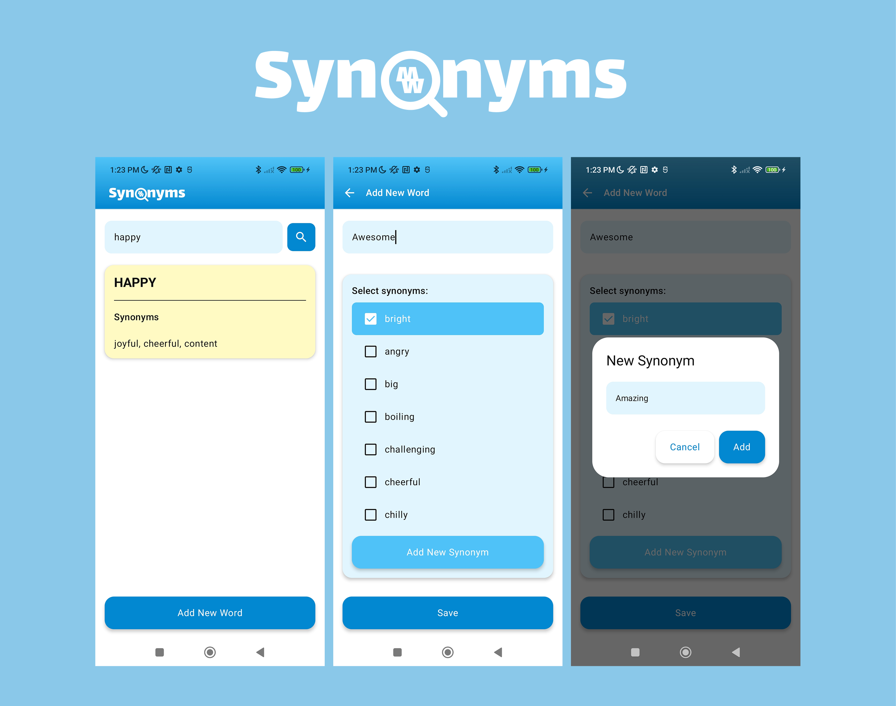

# Synonyms Search Tool

## Overview

**Synonyms Search Tool** is a modern Android app built using Kotlin and Jetpack Compose that allows users to add and search for synonyms in an intuitive and responsive UI. It uses efficient in-memory data structures and is designed with scalability, testability, and performance in mind.

---

## Features

- 🔍 **Search Synonyms**  
  Find all synonyms of a given word with bidirectional and transitive lookup logic.

- ➕ **Add New Synonyms**  
  Add new words and assign multiple synonyms using a guided UI with validation.

- 🔁 **Bidirectional & Transitive Mapping**  
  Searching for any word in a group returns all its connected synonyms.

- 🎨 **Material You UI**  
  Adaptive theming with light/dark support and custom components.

- ⚡ **High Performance**  
  No database or persistent storage – fast, in-memory access.

---

## Architecture

The app follows a modular clean architecture:

app
├── core:model // Shared data models (Word, etc.)
├── core:ui // Reusable Compose components and theme
└── feature:synonyms // Synonym business logic and screens

### Module Dependencies

- `app → core:model`, `core:ui`, `feature:synonyms`  
- `core:ui → core:model`  
- `feature:synonyms → core:model`, `core:ui`

---

## Tech Stack

- Kotlin, Jetpack Compose, Material 3
- Hilt for DI
- StateFlow + ViewModel for state management
- Unit testing with JUnit

---

## Getting Started

1. Clone the project  
   `git clone https://github.com/bmujo/synonyms-search-tool.git`

2. Open in Android Studio (Giraffe or newer)

3. Run the app on device/emulator (API 26+)

---

